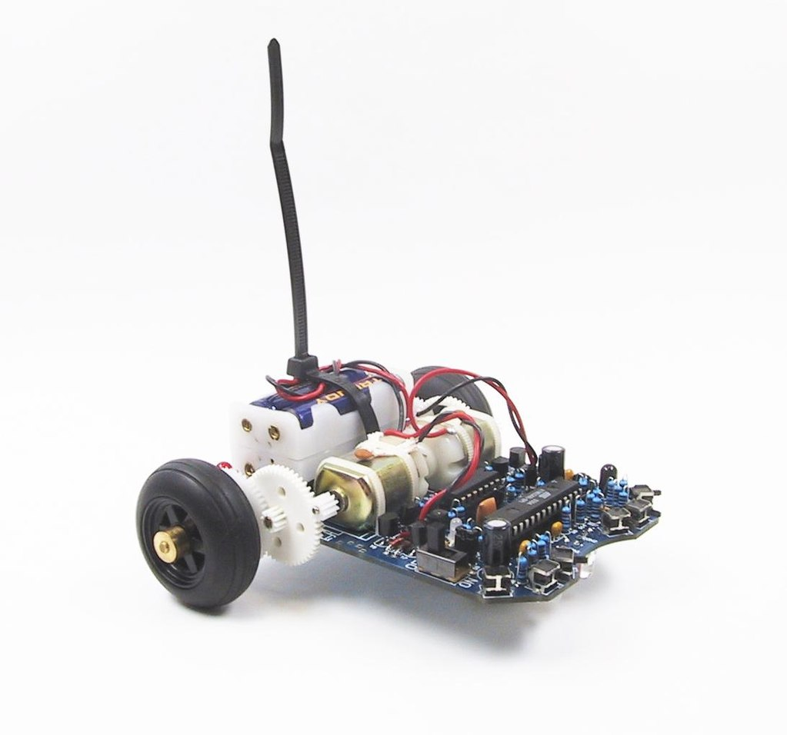

# Example for

## ASURO with ESP32

Tabelle 1.experiment routine.

## Catalog of all c /c++ experiment routine

In the following table,

| Subdirectory | Topic |
|:-------------- |-----------------------------------------|
| [ASURO_leds](experiment-routine/Readme_Files/ASURO_leds.md) | Introduction to ESP32 GPIO and tri-color LEDs.|
| [ASURO_buttons](experiment-routine/Readme_Files/ASURO_buttons.md) | Introduction to ESP32 GPIO Buttons.|
